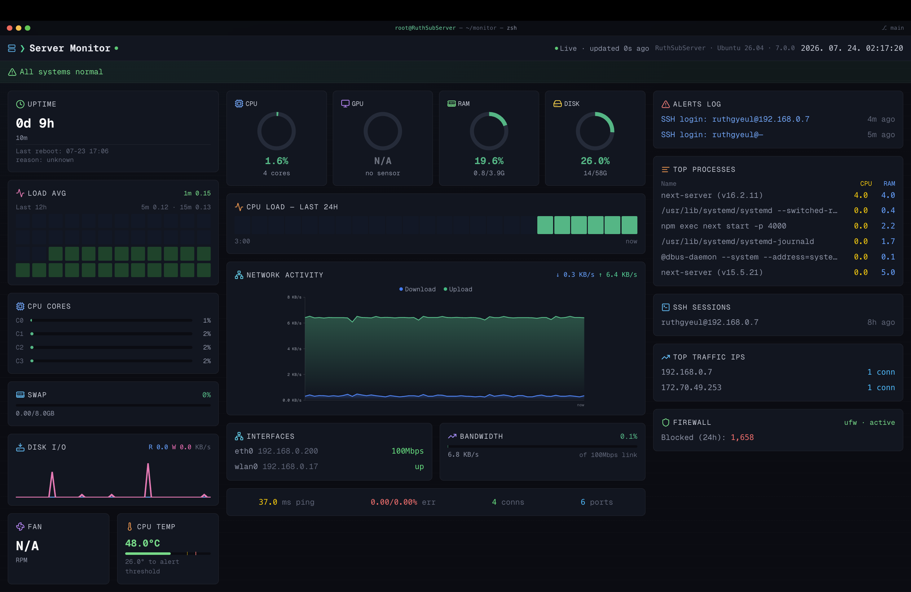

# ServerMonitor

A self-hosted, real-time server monitoring dashboard built with Next.js. It
reads live system metrics (CPU, memory, disk, network, temperature, fan
speed, uptime, top processes) from the host it runs on and exposes them
through a small dashboard UI and a JSON API, with an optional cluster view
that aggregates several nodes on one screen.



## Features

- **Live dashboard** (`/`) — CPU/memory/disk usage, network throughput and
  error rates, temperature, fan speed, uptime, and a top-processes list,
  polling `/api/system` every second.
- **Cluster view** (`/cluster`) — a compact grid that polls multiple
  ServerMonitor instances (e.g. an x86 server plus several Raspberry Pi
  nodes) and shows their status side by side.
- **JSON API** (`/api/system`) — returns the current metrics for the host,
  with a configurable CORS allow-list for cross-node requests.
- **Kiosk launch script** — boots the dashboard full-screen in Firefox for
  a dedicated status display.

## Tech stack

- [Next.js](https://nextjs.org) (App Router) + React + TypeScript
- Tailwind CSS
- Recharts for network history charts
- A shell script (`scripts/monitor.sh`) that shells out to standard Linux
  tools (`top`, `free`, `df`, `sensors`, `ip`, `ps`, …) to collect metrics

## Getting started

### Prerequisites

- Node.js 18+
- A Linux host (metrics collection relies on `/proc`, `sensors`, `ip`, etc.)
- `lm-sensors` installed and configured if you want temperature/fan readings

### Install

```bash
npm install
```

### Configure environment variables

All environment-specific values (cluster node IPs, allowed CORS origins,
site metadata, kiosk settings) live in a single `.env` file instead of being
hardcoded, so the app can be reused across servers/domains without editing
source code.

```bash
cp .env.example .env
```

Then edit `.env` to match your own setup. See
[Environment variables](#environment-variables) below for what each value
does.

### Run

```bash
# development
npm run dev

# production
npm run build
npm run start
```

Open [http://localhost:3000](http://localhost:3000) for the single-server
dashboard, or `/cluster` for the multi-node view.

## Environment variables

`.env.example` documents every supported variable. `NEXT_PUBLIC_*` values are
inlined into the client bundle at build time (needed because the cluster
dashboard fetches other nodes directly from the browser); the rest are only
read on the server.

| Variable | Used in | Description |
| --- | --- | --- |
| `NEXT_PUBLIC_CLUSTER_SERVERS` | `src/config/clusterConfig.ts` | JSON array of `{ "name", "ip", "type" }` objects rendered on `/cluster`. `type` is `"intel"` or `"rpi"` and controls which sensors are read. |
| `NEXT_PUBLIC_CLUSTER_PORT` | `src/config/clusterConfig.ts` | Port each cluster node's `/api/system` listens on (default `3000`). |
| `NEXT_PUBLIC_CLUSTER_PROTOCOL` | `src/config/clusterConfig.ts` | Scheme (`http`/`https`) used to reach cluster nodes from the browser (default `http`). |
| `ALLOWED_ORIGINS` | `src/app/api/system/route.ts` | Comma-separated list of origins allowed to call `/api/system` (CORS allow-list). |
| `NEXT_PUBLIC_SITE_URL` | `src/config/siteConfig.ts` | Canonical site URL used for metadata, Open Graph tags, `robots.txt` and `sitemap.xml`. |
| `NEXT_PUBLIC_SITE_NAME` | `src/config/siteConfig.ts` | Full site/app name shown in page titles and metadata. |
| `NEXT_PUBLIC_SITE_SHORT_NAME` | `src/config/siteConfig.ts` | Short name used in the title template and mobile web app title. |
| `NEXT_PUBLIC_SITE_DESCRIPTION` | `src/config/siteConfig.ts` | Site description used in metadata and social previews. |
| `NEXT_PUBLIC_AUTHOR_NAME` | `src/config/siteConfig.ts` | Author/creator/publisher metadata. |
| `KIOSK_USER` | `scripts/run.sh` | Linux user whose Firefox session is killed/relaunched in kiosk mode. |
| `KIOSK_URL` | `scripts/run.sh` | URL opened in kiosk mode. |

Adding, removing, or repointing a cluster node is now a one-line edit in
`.env` — no code changes or redeploy of the dashboard logic required.

## Scripts

- `scripts/monitor.sh` — collects system metrics and prints them as JSON;
  invoked by the API route on the host it runs on.
- `scripts/run.sh` — launches the dashboard full-screen in Firefox kiosk
  mode, reading `KIOSK_USER`/`KIOSK_URL` from `.env` if present.

## Deploying a cluster

Each node in `NEXT_PUBLIC_CLUSTER_SERVERS` should run its own instance of
this app (so its `/api/system` endpoint is reachable at
`http://<ip>:<NEXT_PUBLIC_CLUSTER_PORT>`), and each node's `ALLOWED_ORIGINS`
should include the origin of whichever instance is displaying `/cluster`.

## Learn more

- [Next.js Documentation](https://nextjs.org/docs)
- [Learn Next.js](https://nextjs.org/learn)
