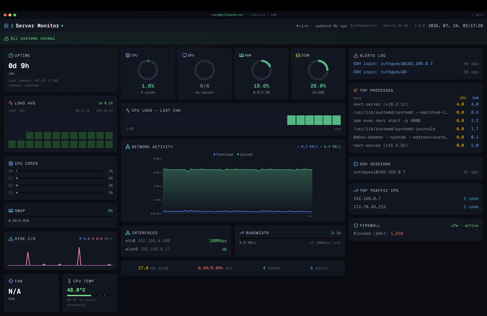

# ServerMonitor

A self-hosted, real-time server monitoring dashboard built with Next.js. It
reads live system metrics (CPU, memory, disk, network, temperature, fan
speed, uptime, top processes) from the host it runs on and exposes them
through a small dashboard UI and a JSON API, with an optional cluster view
that aggregates several nodes on one screen.



## Features

- **Live dashboard** (`/`) — one responsive layout, from a phone to a 7-inch
  kiosk panel (see [Layout](#layout)), fed once a second over a single
  Server-Sent Events stream (`/api/system/stream`):
  - CPU/GPU/RAM/disk gauges, per-core bars, and a 24-hour hourly load heatmap
  - load average with a 48-hour history grid, swap, and disk I/O throughput
  - network throughput chart, interfaces, link utilisation, ping, error
    rates, established connections and listening ports
  - temperature against its alert threshold, fan RPM, uptime and last reboot
  - 24-hour trend history per metric (memory/disk/temp/network), persisted like
    the load/CPU history, plus host-health signals — failed systemd services,
    read-only mounts, disk SMART health/temperature, pending (security) package
    updates, kernel error count, and failed-SSH-login count — surfaced in the
    banner and exported via `/api/metrics`
  - alert log, top processes, SSH sessions, top traffic peers, firewall state
  - keeps the last known values on screen when the stream drops, and says so
    in the header instead of blanking the display
- **Cluster view** (`/cluster`) — a compact grid that shows multiple
  ServerMonitor instances (e.g. an x86 server plus several Raspberry Pi
  nodes) side by side. The browser polls a single same-origin endpoint
  (`/api/cluster`); the server fans out to each node, so node IPs stay
  server-side and nodes no longer need to CORS-allow the dashboard origin.
- **Public status page** (`/status`) — a sanitised, uptime-style summary safe to
  share externally: a status word, rounded CPU/memory/disk, uptime, and an
  active-alert count. It exposes **no** reconnaissance data (no IPs, process
  names, ports, or alert messages) and stays reachable even when `/api/system`
  is token-gated.
- **Kiosk & wall-panel touches** — optional desktop notifications + a beep on a
  new critical alert (toggle in the corner), a one-click JSON snapshot export,
  gauge tiles that pulse when a metric is critical, `?rotate=<seconds>` to
  auto-cycle between the dashboard and cluster views, and a click-through /
  deep-linkable (`/cluster?node=<name>`) node detail modal on the cluster view.
- **JSON API** (`/api/system`) — returns the current metrics for the host,
  with a configurable CORS allow-list for cross-node requests.
- **Kiosk launch script** — boots the dashboard full-screen in Firefox for
  a dedicated status display.

## Layout

The three columns and the card order inside each one come from the design and
are fixed in `Dashboard.tsx` — nothing is auto-placed, so no viewport ever
reshuffles the cards:

| Column | Cards, in order |
| --- | --- |
| Left | uptime · load average + 48h grid · CPU cores · swap · disk I/O · fan + CPU temp |
| Centre | CPU/GPU/RAM/disk gauges · 24h CPU heatmap · network chart · interfaces + bandwidth · ping/err/conns/ports |
| Right | alerts log · top processes · SSH sessions · top traffic IPs · firewall |

Only how many columns stand side by side changes with the viewport:

| Viewport | Columns |
| --- | --- |
| < 640px | 1 — the three columns stack in order |
| 640–1023px | 2 — the right column drops below the left |
| ≥ 1024px | 3, at the design's own 238:472:282 proportions |
| ≥ 960px **and** ≤ 700px tall | 3, at reduced density |

That last row is the 7-inch kiosk panel (1024x600), where every card has to be
on screen at once. The arrangement there is identical — same columns, same
order — and only the sizes shrink: type scale, padding, gauge diameter, chart
and sparkline heights. All of it is one media query in
`src/styles/globals.css`, and the components carry semantic classes
(`t-label`, `dash-card`, `dash-chart`) rather than hardcoded sizes, so
retuning is a matter of editing that block.

Two things to know before changing it:

- The width trigger is 960px rather than 1024px on purpose. If the cards ever
  overflow on a 1024px-wide panel a scrollbar appears, dropping the viewport
  below 1024 — with the trigger at 1024 that would switch the type back up and
  overflow further, a loop. 960 leaves room for the scrollbar.
- The per-panel row caps in `Dashboard.tsx` (`MAX_PROCESSES`, `MAX_INTERFACES`
  and friends) are what bound each card's height. The kiosk layout was checked
  against a 16-core host with six interfaces and every list full, and clears
  600px with roughly 28px to spare per column; raising a cap eats into that.

## Tech stack

- [Next.js](https://nextjs.org) (App Router) + React + TypeScript
- Tailwind CSS
- Hand-rolled SVG charts on the main dashboard (viewBox-based, so they scale
  with the card instead of being measured); Recharts on the cluster view
- `src/utils/systemMonitor.ts` and `src/utils/collectors/*`, which read
  metrics straight from `/proc` and `/sys` and shell out only for `df`, `ps`,
  `ping`, `last`, `systemctl`, `journalctl` and `who` (SSH sessions are
  detected from `/proc` first, with `who` as a fallback)

## Getting started

### Prerequisites

- Node.js 18+
- A Linux host (metrics come from `/proc/stat`, `/proc/meminfo`,
  `/proc/net/route`, `/sys/class/net`, `/sys/class/thermal`, …)
- `lm-sensors` is optional. Install it for per-chip temperatures and fan RPM;
  without it those fall back to `/sys/class/thermal` and `/sys/class/hwmon`,
  and anything still unavailable reads `N/A` rather than zeroing the dashboard

Every panel degrades to `N/A` (never to a fake zero) when its source is
missing. A few need more than `/proc` to show real numbers:

| Panel | Needs |
| --- | --- |
| GPU usage/temperature | an AMD card (`gpu_busy_percent` in sysfs) or `nvidia-smi`. Intel iGPUs have no percentage to read, so they stay `N/A`. |
| Top traffic IPs (in bytes) | `nf_conntrack` with `net.netfilter.nf_conntrack_acct=1`. Without it the panel ranks peers by open connections instead. |
| Firewall blocked attempts | read access to the kernel journal (usually membership in `systemd-journal` or `adm`). |
| Last reboot reason | readable `/var/log/wtmp` and a `last` binary; reports whether the previous shutdown was clean. |
| SSH sessions | detected from sshd session processes (`/proc/<pid>/comm` + cmdline) and established connections on the SSH port(s), so it works without utmp and catches PTY-less sessions (scp/sftp). The remote IP is filled in from the socket when `/proc/<pid>/fd` is readable (own user, or root); otherwise it may read `—`. `who` is merged in as a fallback. Set `SSH_PORTS` if sshd listens somewhere other than 22 and can't read `sshd_config`. |

The 48-hour load grid and 24-hour CPU heatmap are kept in memory by the
running process and persisted to `data/history.json`, so they survive a
restart or redeploy. Any stretch the server was actually down stays empty and
fills in again over time.

If a metric looks wrong on a real host, `./scripts/diagnose.sh` prints what
each of those sources actually returns, and `curl localhost:3000/api/system`
includes a `warnings` array naming any collector that failed.

### Install

```bash
npm install
```

### Configure environment variables

All environment-specific values (cluster node IPs, allowed CORS origins,
site metadata, kiosk settings) live in a single `.env` file instead of being
hardcoded, so the app can be reused across servers/domains without editing
source code.

```bash
cp .env.example .env
```

Then edit `.env` to match your own setup. See
[Environment variables](#environment-variables) below for what each value
does.

### Run

```bash
# development
npm run dev

# production
npm run build
npm run start
```

Open [http://localhost:3000](http://localhost:3000) for the single-server
dashboard, or `/cluster` for the multi-node view.

### Test

```bash
npm test
```

Vitest covers the pure logic that is easy to break silently and hard to notice
on a running host: the history buckets and their on-disk recovery, the 30-minute
rolling average, the colour scale, the CORS header rules, and the
`/proc/loadavg` parser (which cannot run on a non-Linux dev machine at all).
The shell-output collectors are not covered — they need a real host.

## Environment variables

`.env.example` documents every supported variable. `NEXT_PUBLIC_*` values are
inlined into the client bundle at build time (needed because the cluster
dashboard fetches other nodes directly from the browser); the rest are only
read on the server.

| Variable | Used in | Description |
| --- | --- | --- |
| `NEXT_PUBLIC_CLUSTER_SERVERS` | `src/config/clusterConfig.ts` | JSON array of `{ "name", "ip", "type" }` objects rendered on `/cluster`. `type` is `"intel"` or `"rpi"` and controls which sensors are read. `ip` is a base URL the dashboard appends `/api/system` to: a full URL with scheme (e.g. `https://status.example.com`, used as-is) or a bare host/IP (expanded with `NEXT_PUBLIC_CLUSTER_PROTOCOL`/`NEXT_PUBLIC_CLUSTER_PORT`). |
| `NEXT_PUBLIC_CLUSTER_PORT` | `src/config/clusterConfig.ts` | Port for **bare-host** cluster nodes' `/api/system` (default `3000`). Ignored for `ip` entries that already include a scheme. |
| `NEXT_PUBLIC_CLUSTER_PROTOCOL` | `src/config/clusterConfig.ts` | Scheme (`http`/`https`) for **bare-host** cluster nodes (default `http`). Ignored for `ip` entries that already include a scheme. |
| `ALLOWED_ORIGINS` | `src/app/api/system/route.ts` | Comma-separated list of origins allowed to call `/api/system` (CORS allow-list). CORS only limits cross-origin browser reads — it does not authenticate. See [Securing the API](#securing-the-api). |
| `API_AUTH_TOKEN` | `src/proxy.ts` | Optional shared secret. When set, every `/api/system*` request must present it as `Authorization: Bearer <token>` or an `api_auth_token` cookie. Unset by default. On its own it breaks the built-in browser dashboard — pair it with `DASHBOARD_PASSWORD` — see [Securing the API](#securing-the-api). |
| `DASHBOARD_PASSWORD` | `src/app/api/auth/login/route.ts` | Optional login password. When set (with `API_AUTH_TOKEN`), `/login` accepts it and drops an HttpOnly `api_auth_token` cookie so the token-gated API and the browser dashboard work together. The token never reaches client JS. Unset by default (no login page). |
| `RATE_LIMIT_RPM` | `src/utils/rateLimit.ts` | Per-IP request/minute cap on the public JSON endpoints (`/api/system`, `/api/metrics`), protecting the collectors from a busy loop. `0` disables it. Default `300` — generous enough for cluster polling and several dashboards. |
| `NEXT_PUBLIC_SITE_URL` | `src/config/siteConfig.ts` | Canonical site URL used for metadata, Open Graph tags, `robots.txt` and `sitemap.xml`. |
| `NEXT_PUBLIC_SITE_NAME` | `src/config/siteConfig.ts` | Full site/app name shown in page titles and metadata. |
| `NEXT_PUBLIC_SITE_SHORT_NAME` | `src/config/siteConfig.ts` | Short name used in the title template and mobile web app title. |
| `NEXT_PUBLIC_SITE_DESCRIPTION` | `src/config/siteConfig.ts` | Site description used in metadata and social previews. |
| `NEXT_PUBLIC_AUTHOR_NAME` | `src/config/siteConfig.ts` | Author/creator/publisher metadata. |
| `PING_HOST` | `src/utils/systemMonitor.ts` | Host pinged for the latency reading. Defaults to `8.8.8.8`; set it to a reachable host if outbound ICMP is blocked, otherwise ping shows `0`. |
| `SSH_PORTS` | `src/utils/collectors/security.ts` | Comma-separated SSH port(s) used to match active sessions. Normally read from `sshd_config` with a fallback to `22`; set only if sshd listens elsewhere and the config isn't readable. |
| `KIOSK_USER` | `scripts/run.sh` | Linux user whose Firefox session is killed/relaunched in kiosk mode. |
| `KIOSK_URL` | `scripts/run.sh` | URL opened in kiosk mode. |

Adding, removing, or repointing a cluster node is now a one-line edit in
`.env` — no code changes or redeploy of the dashboard logic required.

## Bare-metal deploy (systemd)

To run ServerMonitor directly on a host (no Docker) as a service that starts on
boot and restarts on failure:

```bash
# /opt is root-owned, so create the target and hand it to your deploy user first
# (the installer then defaults RUN_USER to that owner rather than root).
sudo mkdir -p /opt/servermonitor
sudo chown "$USER" /opt/servermonitor
git clone https://github.com/Ruthgyeul/ServerMonitor.git /opt/servermonitor
cd /opt/servermonitor
cp .env.example .env   # edit as needed
sudo ./scripts/install.sh
```

`scripts/install.sh` checks for Node.js 18+, runs `npm ci` and `npm run build`
as the service user, creates the `data/` directory, then renders and installs
`deploy/servermonitor.service` into `/etc/systemd/system/` and enables it.

It is configurable via environment variables:

| Variable | Default | Purpose |
| --- | --- | --- |
| `RUN_USER` | the checkout's owner | Service account the app runs as |
| `PORT` | `3000` | Port to listen on |
| `SERVICE` | `servermonitor` | systemd unit name |

Then:

```bash
systemctl status servermonitor
journalctl -u servermonitor -f
sudo systemctl restart servermonitor   # after editing a server-only value in .env
```

`NEXT_PUBLIC_*` values (cluster servers, site metadata) are inlined at build
time, so changing one needs a **rebuild**, not just a restart — rerun the
installer, which rebuilds and restarts:

```bash
sudo ./scripts/install.sh
```

The unit adds the service user to the `systemd-journal` and `adm` groups so the
firewall / kernel-error / failed-login collectors can read the journal without
running as root. Running on bare metal (rather than in a container) is also what
lets the `systemctl`/`journalctl`/`who`/`last` collectors report real values.

## Alerting

Threshold rules evaluate every collection tick with hysteresis (separate enter/
clear values) so a value hovering at the line doesn't flood the log. Beyond the
core CPU/memory/disk/temperature/swap rules, the set covers **load per core**,
**GPU temperature**, **low battery**, **disk fill-forecast** (hours to full), and
a composite **memory-pressure** rule (RAM and swap both high). Optional
**statistical anomaly detection** (`ALERT_ANOMALY_ENABLE`) flags CPU that departs
sharply from its own recent baseline even under the absolute threshold.

Every alert shows on the dashboard's alert card and is persisted to
`data/alerts.json`. The **`/alerts`** page is the full history with a level
filter, text search, and a 48-hour incident timeline.

Outbound notifications (off until `ALERT_WEBHOOK_URL` is set) support `json`,
`slack`, and `discord` shapes, **per-severity routing** (`ALERT_WEBHOOK_URL_CRITICAL`
etc.), and optional **batching** (`ALERT_BATCH_MS`). **Flapping suppression** stops
a rule that toggles rapidly from paging (it stays on the on-screen log). To
silence notifications during maintenance, set **quiet hours**
(`ALERT_QUIET_HOURS="22:00-07:00"`) or mute at runtime:

```bash
curl -X POST localhost:3000/api/alerts/mute -H 'Content-Type: application/json' -d '{"minutes":30}'
curl -X DELETE localhost:3000/api/alerts/mute   # lift early
```

All alert tuning lives in environment variables — see `.env.example`.

## Scripts

- `scripts/diagnose.sh` — prints the raw contents of every source the API
  reads, so you can see which metric is unavailable on a given host.
- `scripts/run.sh` — launches the dashboard full-screen in Firefox kiosk
  mode, reading `KIOSK_USER`/`KIOSK_URL` from `.env` if present.
- `scripts/monitor.sh` — standalone JSON dump of the same metrics. Not used by
  the API route; kept for shelling out from other tooling.

## Securing the API

`/api/system` and `/api/system/stream` return sensitive host reconnaissance:
SSH session source IPs and usernames, listening ports, top traffic peer IPs,
firewall state, and the running process list. **The endpoint is unauthenticated
by default**, and the `ALLOWED_ORIGINS` CORS list only restricts cross-origin
reads from browsers — it does nothing against `curl` or any script. Anyone who
can reach the port can read everything.

Pick at least one of these, in rough order of preference:

1. **Network isolation (recommended).** Bind the app to `localhost` and expose
   it only through a reverse proxy (nginx/Caddy/Traefik) that terminates TLS and
   enforces auth (Basic auth, mTLS, OAuth2 proxy), or keep it reachable only
   over a VPN / private network. This keeps the browser dashboard fully working.
2. **Optional token gate.** Set `API_AUTH_TOKEN` (e.g. `openssl rand -hex 32`).
   Every `/api/system*` request then needs `Authorization: Bearer <token>` or an
   `api_auth_token` cookie. This suits machine-to-machine polling or a reverse
   proxy that injects the token. On its own it disables the built-in browser
   dashboard, which cannot carry a secret token from the browser.
3. **Token gate + login (keeps the dashboard).** Set `API_AUTH_TOKEN` **and**
   `DASHBOARD_PASSWORD`. The `/login` page verifies the password server-side and
   drops the token as an HttpOnly `api_auth_token` cookie the browser then sends
   automatically, so the gated API and the dashboard both work; the token itself
   never reaches client JavaScript. `curl` without the cookie still gets `401`.

A coarse per-IP rate limit (`RATE_LIMIT_RPM`, default 300) also guards
`/api/system` and `/api/metrics` so an open deployment can't be driven into a
collection busy loop.

The app also sends hardening response headers (`X-Frame-Options: DENY`,
`X-Content-Type-Options: nosniff`, a `frame-ancestors 'none'` CSP,
`Referrer-Policy`, `Permissions-Policy`, HSTS) from `next.config.ts`, and the
process list reports executable names only (never full command lines) so
secrets passed as CLI arguments are never exposed.

## Deploying a cluster

Each node in `NEXT_PUBLIC_CLUSTER_SERVERS` should run its own instance of
this app so its `/api/system` endpoint is reachable at the node's base URL.
Give each node either a full base URL (`"ip": "https://status.example.com"`,
appended with `/api/system` as-is) or a bare host/IP (`"ip": "192.168.0.100"`,
reached at `<NEXT_PUBLIC_CLUSTER_PROTOCOL>://<ip>:<NEXT_PUBLIC_CLUSTER_PORT>`).

The `/cluster` page fetches a single same-origin endpoint (`/api/cluster`),
and the dashboard **server** fetches each node's `/api/system`. Because those
node requests are server-to-server, nodes no longer need to CORS-allow the
dashboard origin for the cluster view, and node IPs never reach the browser.
If a node has `API_AUTH_TOKEN` set, the dashboard forwards its own
`API_AUTH_TOKEN` as the bearer token when polling that node.

## Learn more

- [Next.js Documentation](https://nextjs.org/docs)
- [Learn Next.js](https://nextjs.org/learn)
